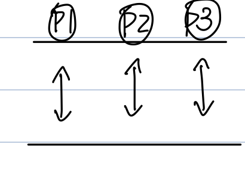

# CH1: OS基本介紹

1. Computer System Structure

2. OS Structure

3. OS之目的（角色）

4. System Type（or Computing environment）

5. Multiprogramming

6. Time-Sharing

7. MultiCores

8. Distribnted（Client-Server、Peer-to-Peer）

9. Real-Time

10. Mobile Computing

    

## Computer System Structure

4個Component：

1. Hardware **e.g. CPU、Disk、Memory**

2. Operating System

3. Application Programs and System Programs

4. User **e.g. 人、other machines、other system**

## OS之Structure

OS的服務對象有：

- User（人）

- 執行中之程式（Applications）

  

OS對外介面（Interface）：

1. User interface（for 人）（or Command interpreter）：
   接收user input Commands，判斷正確與否，若正確可invoke reload system calls，請OS完成該命令請求。

   - 種類

     1. Menu

     2. Command line（命令列） **e.g. MS-DOS、UNIX、Linux**

     3. Batch：將一些Commands完成<u>批次檔</u>（xxx.bat）

     4. GUI（Graphic User Interface） **e.g. MacOS、Windows系列**

     5. Touch Screen（e.g. Smart Phone）

        Voice辨識（e.g. Siri）
        
     
    - kernel：The one program running at all Times on the computer is the kernel. It is part of the OS.
    <u>即重要服務元件之集合</u>
   
    e.g. process Managernent、Thread、Memory、I/O Subsystem protection、security、etc.
   
2. System Calls：作為Applications and OS kernel介面

## OS之目的（角色）

1. OS作為User（人）跟Hardware之界面

   -> 方便User易於操作Computer

2. 提供一個讓Applications易於執行之環境。

   即很多底層之硬體控制不須Application來直接運作，而是委託OS來執行。

3. 作為一個Resource Allocator（e.g. CPU、Memory、I/O Device、etc.）

   希望達到有效運用這些資源，even公平使用。

4. 作為一個監督Application執行的角色

   防止它們有意或無意之操作，所造成System的重大危害。

## System types
- Multiprogramming system
   1. Def：允許多個Processes(job) in the Memory(system)，同時執行。

      **主要目的：提高CPU utilization**
      
      - Single user cannot keep the CPU and device busy at all times.
      - So, multiprogramming organizes job(code and job). So CPU always has one to execute.
      - One job selected and run via job scheduling.
      e.g. When it has to wait（e.g. for I/O completed）, OS can switch to another job.
      
   2. Multiprogramming Degree：待在系統內執行的processes數目。
   
      - 一般而言，若Multiprogramming Degree越高，CPU utilization越高。
   
   3. 多個工作（jobs or processes）同時執行之方式有二：
   
      1. Concurrent（一顆CPU時）
      
         
      
      2. Parallel（多顆CPUs or MultiCores）
      
      
      
      > Ex：True or False
      >
      > 1. Multiprogramming一定要Multiprocesses支持才行？
      >
      >    False（因為Single-CPU也可以），EX：Concurrent
      >
      > 2. Multiprogramming一定要Multiusers支持才行？
      >
      >    False（因為Single user system也可以），EX：個人電腦
## Time-sharing system（分時系統）
1. Def：又叫Multitasking［恐］

   It is a logical extention of Multiprogramming system.
   - CPU switch jobs so freguently. So that user can iteract.（more than multiprogramming）
   - So that user can iteract with each job while it is running, creating interactive computing.
   強調：
   1. Response time要短（e.g. <1 sec）
   2. 對每個user job要公平對待
   3. 讓每個user覺得有自己專屬的computer之感覺
   技術（那時已提出）
   1. CPU scheduling採用RR排班［ch4］
   2. 有Swapping技術，即Virtual Memory［ch8］
   3. 有Spooling技術，讓每個Users有自己的I/O Device之感覺，同時也有Buffering技術（use Memory）一併採用

## MultiProcessors system
1. Def：又叫Multiprocessing or Parallel or Tightly-Coupled system

   - 主要features如下：
   
      1. 一部機器（or 主機板）內裝置多顆processors（or CPUs），所有CPUs均共享此一machine內之memory、Bus、I/O-Device、Power-supply、etc.
      2. 通常所有CPUs均受同一個clock之時脈控制
      3. 通常，由同一個OS管控所有CPUs
      4. 這些processors之間的溝通大都採"shared Memory"方式（ch6）

2. Benefits：

   1. Increated Throughput
   2. Increated Reliability
   3. Econorny of Scale

   - 分述如下：
      1. 產能增加：因為支持parallel computing同一時間內，可有多個工作在不同CPUs上**平行執行**
      > Note：N顆CPUs之產能絕對小於1顆CPU產能乘上N部
      > 理由：
      > 1. Resource Contention（資源競爭）
      > 2. Processors之間的Communication
      > 因上述導致不見得工作可以平行執行，所以效能會被抵減

      2. 提升可靠度
      -> 萬一某CPU壞了，其他CPUs仍正常工作，所以系統不致停頓
      > Note：名詞
      > 1. graceful degradation
      >    -> 漸進式毀滅
      >    Def：系統不會因為某些元件（e.g. Hardware or Software）故障而停頓，而仍保有持續運作之能力。
      > 2. Fault Tolerant system
      >    -> 容錯系統
      >    Def：具有graceful degradation能力之系統。
   
3. 可再細分為兩個Subtypes：

   1. Asymmetric Multiprocessing（非對稱式ASMP）
      Def：每個Processors所負責（提供）之工作能力不盡相同，通常採用Master-slave架構。
      **（主 - 僕） or （Boss - employee）**
      即有一個CPU叫Master，負責**工作分派**及**資源配置**工作，其他的CPU叫做slave，負責執行被分配的工作
      
      - 優點：OS之開發**比較簡單**，因為很容易從simple-CPU OS版本修改而得。
      - 缺點：
      1. **效能比較差**（than SMP），因為Master CPU會是瓶頸。
      2. **可靠度比較差**（than SMP），因為若Master CPU壞了，系統會停頓，等到選出新的Master才會恢復。
      
   2. Symmetric Multiprocessing（對稱式SMP）
      Def：每個Processors之工作能力皆相同（identical），且均有對等權利存取各式資源。
      **優缺點則與ASMP相反**
      
      > Note：在現今硬體CPU晶片也產出了"MultiCores" CPU chip
      > 例：雙核心CPU chip，Multiprocessors（2顆single-Core CPU）
      > MultiCore chip：1. 速度較快、2.更省能源（power saving）
      > ✨但就對OS的角度來看，它們是一樣，皆為多個"logical" CPUs。
      > 例：主機板上裝置
      > = 1顆4核心cpu chip
      > = 4顆1核心cpu chip
      > = 2顆2核心cpu chip
      > -> 對OS而言，皆為4個logical CPUs

## Distributed system（分散式系統）
1. Def：又叫Losely-Coupled system

   - 主要features如下：
      1. 多部machines彼此以Network（e.g. LAN、Internet）相互串聯
      2. 每部machine內之CPU有自己的（local）Memory、Bus、I/O-Devices、etc. 並非共享
      3. 各CPU之時脈（clock）控制不一定相同
      4. 各CPU之OS也不一定相同
      5. Processors之間溝通大都採"Message Passing"方式（ch6）

2. 構建之理由（or Benefits）

   1. Throughput增加
   2. Reliability提升
   （以上兩個同Multiprocessors）
   3. Resource Sharing 因為Cost down
      理由：它支持client-server Computing environment
      - Server：提供某些服務之machine
         例：File server、mail server、printer server、computing server、DNS（Domain Name Server）
      - Client：不提供任何服務，純粹向Server提出服務請求，再由Server提供服務給client
      > Note：另一種model：
      >    "peer-to-peer" computing environment
      >    - 無法（不用）區分出Client or Server
      >    - machine（or Nodes）即是client也是server
      >    - Nodes加入peer-to-peer model時，會register its service reguest and provided
      >       - 採central lookup service
      >         or
      >       - 採broad creating方式
   
4. remote Communication（遠端通信需求之滿足）
   
   e.g. e-mail、FTP over Internet
## Real-Time（即時） System
可分為兩種subtypes：
1. **Hard** real-Time system

   1. Def："This system must ensure the critical tasks complete on time"
      即必須保證工作可以在規定時間內完成，若超時則失敗。
   2. 例：軍事防衛系統、核能安控、工廠自動化、etc.
   3. 系統設計需考量：
      1. 任何可能影響時間之因素須納入考量。
         e.g. 處理Algo、signal/data傳輸、系統處理延遲、etc.
      2. 任何可能造成處理時間過長或不可預期之設備機制宜**少用**或**不用**。
         例1：Disk少用或不用。 -> 程式燒錄至RAM or 作成晶片 or 載入RAM。（e.g. embeded real-Time system 嵌入式）
         例2：Virtual memory不予採用。因為page fault處理時間太長。
      3. 盡量降低kernel之介入干預時間。
         
         > Note：很多實際Hard real-Time system是**沒有**OS，如果要有也是特殊設計。
         
      4. 一般的OS（e.g. UNIX、Linux、Windows、etc.）不支援Hard real-Time features。
      5. 不會與Time-Sharing system並存
   
2. **Soft** real-Time system

   1. Def："This system must ensure the real-Time process has the highest priority than the others and retain**（維持住、不可衰退）** this level of priority until it compeled"
   2. 例：Multimedia system、Virtual Reality、Science simulation、etc.
   3. 系統設計考量：
      1. 就CPU scheduling而言（ch4）
         - 提供Preemptive、priority法則
         - 不提供"Aging"技術
      2. 盡量降低kernel之Dispatch latency（ch4）
      3. 現行的OS皆可支援Soft real-Time features
      4. Soft real-Time可支持Virtual memory之使用（只要求real-Time process之Pages皆須在memory中直到完工）
      5. 可與Time-sharing並存

## Mobile Computing
1. 例：Mobile devices
   e.g. Smart phone、PAD
2. 主要因為mobile device硬體上先天限制，使得在OS及Application設計時有所限制。如下表所示：

| HW之先天限制                                                 | SW之設計限制                                          |
| :----------------------------------------------------------- | :---------------------------------------------------- |
| 1. Slower processor     ( i )power耗能大     ( ii )散熱問題 | 運算不宜過度複雜 程式宜精簡                      |
| 2. memory size小                                             | 不用的memory space即刻released                        |
| 3.Display screen小                                           | 顯示之結果或內容宜有所裁減 e.g. 手機專用web site |

3. 例：Apple iOS、Android by Google

## Batch（批次） system

Def：將一些非常急迫性或週期性之工作累積成堆，再整批送入系統處理。處理過程中不須與user interaction（互動）
**例：報稅、下載軟體更新、掃毒、磁碟重組、庫存盤點、etc.。**

主要目的：想提高冷門時段之**資源利用度**。
**不適合**用在須user-interactive application及real-Time applications