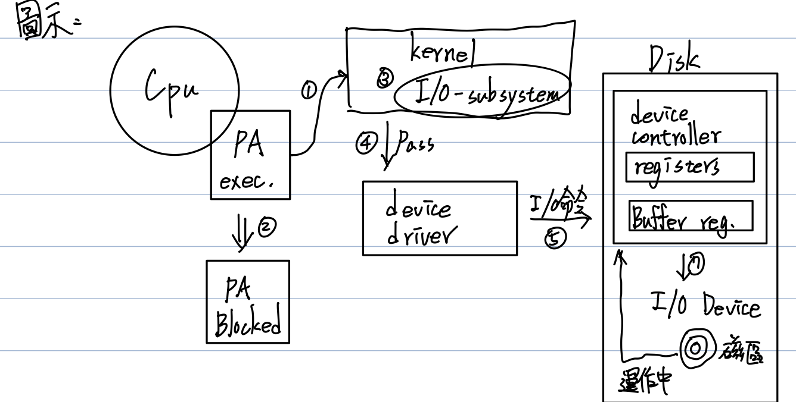
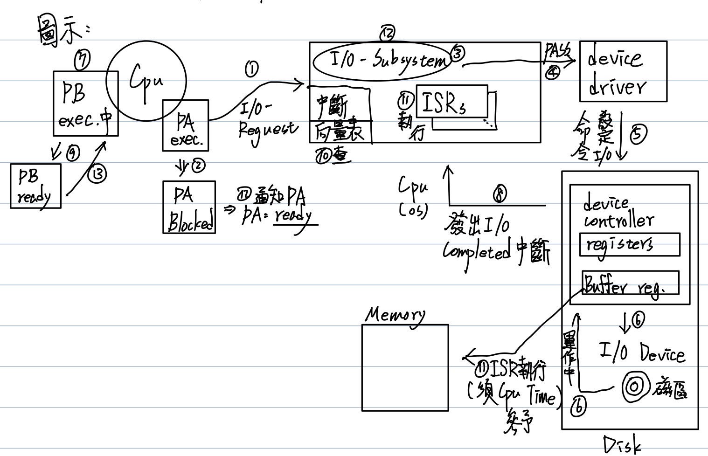
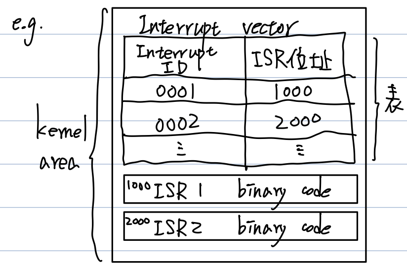

# CH2：I/O運作方式

Interrupt介紹、Hardware Resouce Protection

- I/O運作方式
   - polling I/O
   - Interrupted I/O
   - DMA
- Interrupt介紹
   - Interrupt之處理
   - 種類
- Hardware Resource Protection
   - 基礎
      - Dual modes運作
      - privileged instructions
      
   - I/O、Memory、CPU。protection
## I/O運作方式
### polling（詢問式） I/O
1. Def：又叫做Busy-waiting I/O或Programmed I/O
   - Step如下
      1. 執行中的process，發出I/O reguest給OS，希望I/O提供某種I/O服務。**e.g. Disk read a File**
      2. OS收到請求後，（可能）會先暫停（block）該process，即此process會放掉CPU，並置於waiting Queue，等待I/O-compeled。
      3. OS（or kernel）中的I/O-subsystem會處理此請求。
         e.g. 它會check **Disk cache**是否有命中，若有則從Disk cache取出File資料，不用Read I/O，反之則執行Read I/O
      4. I/O-subsystem會Pass此請求給device driver（驅動程式）。
      5. device drive會依此請求，設定相關I/O-commands到device controller（硬體）。
      6. device controller會指揮I/O-Device執行I/O運作。
      7. 此時，CPU可能idle，OS可能會將CPU分派給其它process使用。
      8. CPU會不斷的去Polling I/O-Device controller上之相關registers值，確定I/O運作完成與否或有無error。
      > 缺點：CPU並未將全部的Time用於Process exec.上，而是耗費大量時間去Polling I/O-Device controller，所以CPU utilization不高，且Process Throughput偏低。

### Interrupt（中斷式） I/O
1. Def：Step如下
   1. ~   7. 如前述Polling I/O
   8. 當I/O運作完成，I/O-Device controller會發出一個"I/O-Completed" interrupt通知CPU（OS）。
   9. OS收到中斷通知後，（可能）會先暫停目前執行中的Process。
      **e.g. PB exection -> Read status**
   10. OS會依據Interrupt ID（No）查詢Interrupt vector（表），找出中斷對應的**服務處理程式**（ISR；Interrupt Service Routine）之位址。
   11. Jump to ISR位置，ISR執行。
         **e.g. 將File Data從Controller之Buffer registers搬到memory中**
   12. ISR完成，控制權交回kernel I/O subsystem，通知Process其I/O-Completed及告知結果。
   13. OS恢復中斷之前Process的執行（e.g. PB exec.）或交由CPU schedulen決定下一個執行之Process

> 優點：
> 
> CPU無須花費時間用於Polling I/O-Device controller，而是可全心用於Process之execution上，所以CPU utilization較高，Throughput相對也較高。故improve the system performance。
> 
> 缺點：
> 1. Interrupt之處理仍須耗費CPU time（e.g. 查表、執行ISR、保存中斷前Process之Status、etc.），此段時間CPU time無法用於user process execution。
>    **Note：若I/O運作時間很快速（大於Interrupt處理Time），此時Polling反而比較好**
> 2. 若Interrupt發生頻率較高，則CPU utilization會很差。因為CPU time幾乎都花在中斷之處理上。
> 3. CPU仍須耗費CPU time用於I/O-Device controller與Memory間的Data transfer上。

   P.40 - 41 ［恐］Lifecycle of An I/O-reguest

### DMA（Direct Memory Access）
1. Def：DMA controller負責I/O-Device與Memory之間的Data transfer工作，此transfer過程不須要CPU之參予。
   因為CPU有更多時間用於Process exec.上。（優點 1）
   - 另外DMA適合用在Block-Transfer oriented I/O-Device，例：Disk
   > Note：可以降低I/O-Completed中斷頻率
   > **Note：考點
   >  Byte-transfer oriented (X)
   >  Character (X)**

   - 缺點：引入DMA controller，會**增加硬體系統設計之複雜度**（Complicates Hardware Design）
      理由：DMA controller必須與CPU競爭Memory與Bus之使用權。
      **故必須有一個硬體協調設計機制，此技術叫做"interleaving"或cycle stealing。**
   - 有時CPU會被迫等待DMA when it make use of memory bus。當與CPU conflict時，通常給DMA高優先權。
      理由：DMA對Memory、Bus之使用頻率低於CPU很多，優先配給DMA會有比較小的平均Waiting Time及較高之產出（Throughput）。
### Interrupt介紹
1. kernel所在的memory area中，會存有一個"Interrupt vector"（表），內放各式interrupt ID及各式ISRs之位址，此外也會存放這一些ISRs之Binary Code。

2. Interrupt發生後，OS之處理Steps：
   1. OS收到中斷後，若要立即處理，則會先暫停目前Process執行，且會保存其Status。（e.g. PB被暫停（running -> ready Queue）PB之Status會保存（ch4））
   2. OS會查詢Interrupt Vector based on "Interrupt ID"，確定何種中斷發生，且找出它的ISR位址。
   3. Jump to ISR位址，執行ISR。
   4. 待ISR完成後，return Contro to kernel。
   5. kernel resumes（恢復）原先中斷前之Process執行。
      **e.g. PB恢復執行**
   
3. Interrupt種類
   ［分類一］分為三種：

   1. External interrupt
      -> CPU以外的週邊設備或元件所發出的。
      > 例："I/O-Completed"中斷，由Controller發出
      >    "I/O-error"中斷，由Controller發出
      >    "machine-check"，開機時各設備回報其是否正常
      
   2. Internal interrupt
      -> CPU執行Process時，遭遇重大error而引起。
      
      > 例：divide-by-zero、illegel特權指令執行
      
   3. Software interrupt
      Def：Process在執行時，若需要OS提供某種服務時，它會發出此類型**中斷**通知OS，OS收到通知後，才會執行相關的**服務項目**（ch3 system calls）。
   
   
   
   ［分類二］分為兩種✨✨✨：
   
   | Interrupt                                                   | Trap                                                         |
   | ----------------------------------------------------------- | ------------------------------------------------------------ |
   | Def：Hardware-generated change of control flow.             | Software-generated interrupt                                 |
   | 例："I/O-Completed"、"I/O-error"、"machine-check"via device | 用途有二： 1. Catch the arithernatic error（即Process執行遭遇重大error） e.g. divide-by-zero、illegal memory access、etc. 2. Software interrupt用途Process執行，需要OS提供服務時，會先發trap通知OS。 |
   
   ［分類三］：中斷發生後，是否需要立刻處理？或上個中斷還在處理，又有其他中斷發生，是否要立刻處理？
   > Interrupt之間應有優先權

   分為：
   1. Non-maskable（不可遮罩） interrupt：此中斷須立刻處理。
      **e.g. 重大error引起之中斷（internal中斷）**
   2. Maskable interrupt：此類中斷發生，可以ignore it或delay processing。
      **e.g. Software interrupt**