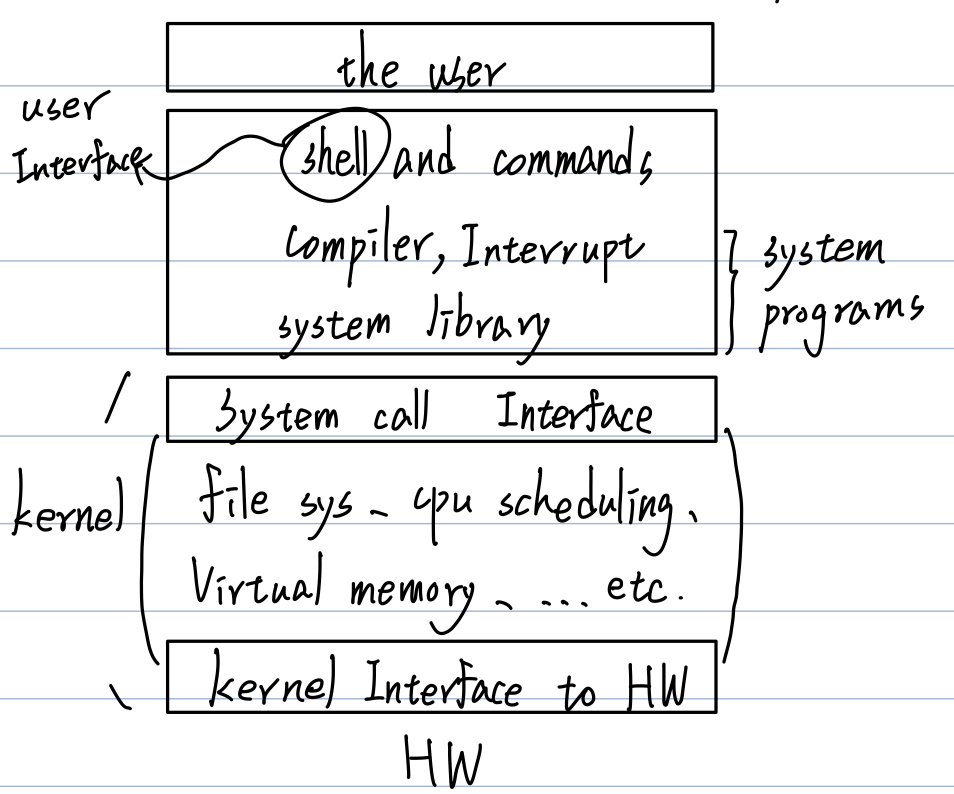
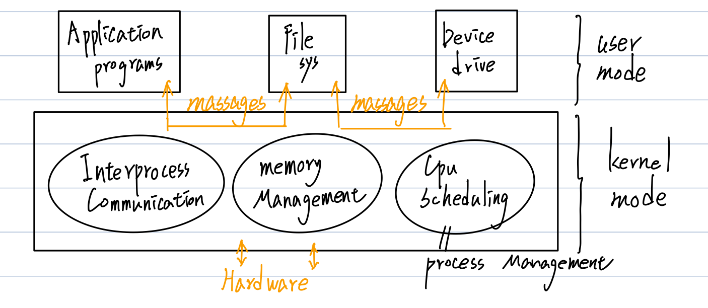
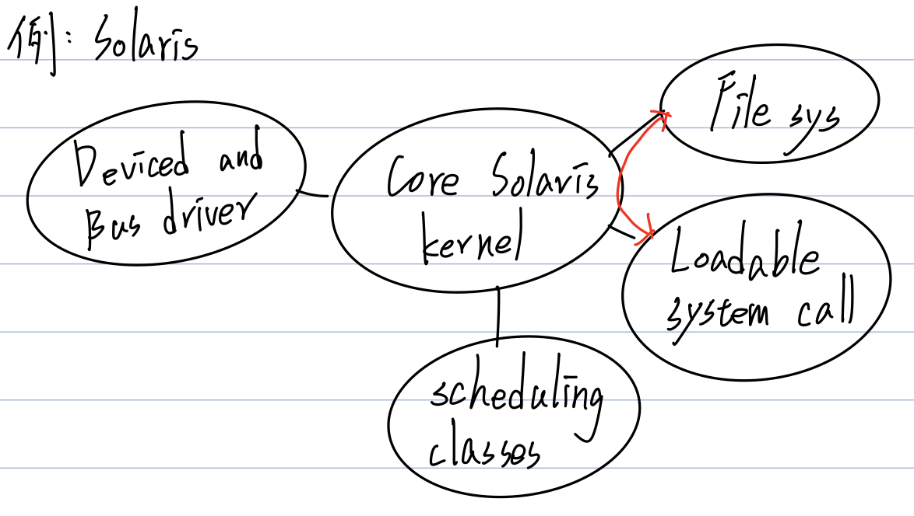
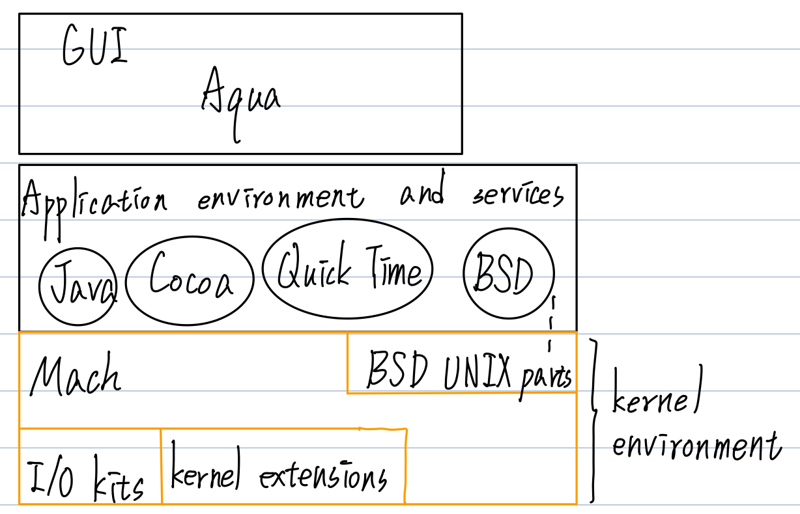
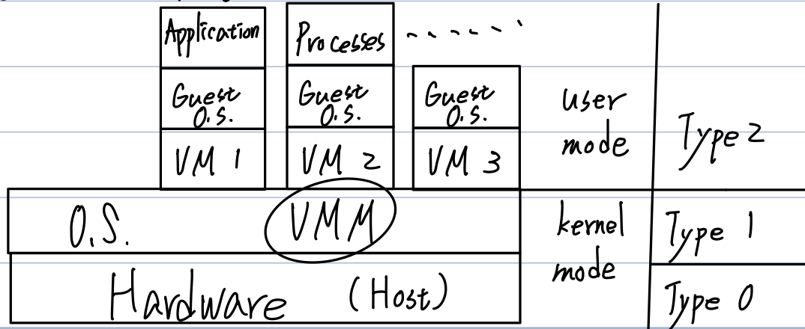

# CH3 OS Structure and Development

- OS Services provided
- OS Components概述
- System call介紹
  - Def:star:
  - 種類
  - 參數傳遞方式:star::star::star:
- Policy and mechanism:star::star:
- OS Structures（架構）介紹
  - Simple
  - More Complex
  - Layered Approach
  - Microkernel、Monolithic:star::star::star::star:
  - Modular
  - Hybrid
- Virtual machine
  - 定義
  - VMM（Hypervisor）之種類:star::star:
  - Virtualization之變形:star:
  - 優點（應用） -> Cloud computing:star:

## System call介紹

1. 目的：作為執行中user process與kernel溝通之界面，代表OS可以提供之服務項目。當Process執行時，若需要OS提供某種服務（e.g. Disk read Text.txt的內容）時，Process會Issue Trap，代入**System call ID**（Disk read）及**相關參數**（檔名Text.txt），當OS收到此請求後，會去執行對應的System call，當完成後，再將服務結果通知回傳給Process。

   圖示：

   

2. System call種類（P30~31）

   1. Process Control（ch 4）
   
   2. File Management
   
   3. Device Management
   
   4. Information maintenance
   
   5. Communications -> 支援"Message Passing" Only
   
   6. Protection
   
      Control access to resource
   
      - Get and set permission
      - Allow and deny user Access
   
      > EX：C程式如下
      >
      > ```c
      > {
      >   	int X;
      >   	X = 5;
      >   	int *p;
      >   	//
      >   	//
      >   	//
      >   	scanf(...); // I/O
      >   	p = molloc(int); // 要求配置Memory Node space
      >   	prinf(...); // I/O
      >   	exit(); // Process終止
      > }
      > ```
      >
      > 上述哪些敘述會引發System Call
      >
      > 其他：fopen()、fclose()、fread()、fwrite()
   
3. System call參數傳遞方式✨

   

   - 方法一：利用Register保存參數，OS自這些Register讀取參數。

     優點：Simple、Fast access（因為Without memory access）

     缺點：不適合用在大量參數之情況（因為Register數量有限）

   - 方法二：利用Memory，以一個Block（or Table）保存這些參數，且將此Block（Table）之位址，存至一個Register中，Pass it to OS。

     優點：適用大量參數之情況。

     缺點：存取速度比較慢。

   - 方法三：準備一個Stack，參數可被Push入Stack，OS再自此Stack **pop**以取得參數。

     優點：適用於大量參數之情況，操作比較simple。

     缺點：Stack size宜大，避免overflow［其他版本］

## Policy（政策） and Mechanism（機制）

1. Policy：決定 **What** will be done?（provided）

   特色：經常改變。

2. Mechanism：決定 **How** to do it?

   特色：underlying mechanism通常不會改變 or 改變頻率很低。

3. 例：

   用Timer作CPU protection -> Mechanism

   Max-Time-Quantum值制定 -> Policy

   用Priority作CPU sheduling -> Mechanism

   優先權大小定義 -> Policy

4. 設計原則：Policy and Mechanism應該Separate（分開；或獨立）

   => Allow high flexibility（高彈性度）

## OS structures（架構）

- Simple => 例：MS-DOS
- More Complex than simple
- Layered Approach
- Microkernel、Monolithic
- Modular
- Hybrid

### More Complex than simple

例：UNIX than original UNIX is limited by hardware functionality.

- UNIX OS consists of two separable parts

  - System programs

  - The kernel（Provides filesystem、CPU scheduling、Memory management、etc.）大多數functions皆位於同一個Level。

    

### Layered approach

- 比較是**抽象化**模型

- 採Top-Down切割，將系統分解成數個關鍵元件。這些元件利用其呼叫（使用）關係，切分出Layer（層次）。

  > 原則：上層可以使用下層功能，但下層不可以使用上層功能。

- 將來測試時，以Bottom-up方式測試。

  > 例：用的較成功之Model：OSI 7 Layers Network model

- 優點：

  1. 易分工，因為模組化。
  2. 易Testing、Debugging、Verification。

- 缺點：

  1. 不易判定出精確的Layer劃分。
  2. 若Layer數目多，則Performance會很Poor。

### Microkernel（微核心）

1. 起源：CMU（卡內基美隆大學）最早提出此觀念，是要簡化UNIX而發展出Mach OS。

2. Def：將kernel中一些Non-essential services自kernel中移除，改成在User site以System software / library方式提供服務，以使得到一個**較小的**kernel，稱為Microkernel。

   > 一般而言Microkernel提供下列minum services：
   >
   > 1. Process Management
   > 2. Memory Management
   > 3. Process Communication（只提供Message Passing Services）

   > Note：其他如File System、Device Management、Virtual Memory、etc. 不在Microkernel（or kernel mode），而僅在User Mode下運行。

   

3. 優點：

   1. Easier to extend a Microkernel.
   2. Easier to port the OS to new hardware architecture.
   3. More **reliable** and secure.

   說明：

   1. 我們可以很容易增添（or 移除）很多服務在User site，不需要kernel隨之變更修改，即使kernel要配合修改，也是少量修改而已。
   2. 很容易將Microkernel從一個硬體平台移植到另一個不同的硬體平台，因為修改的量不大。
   3. 萬一若某個Services fail，因為它Run在User site，所以不會影響其他Processes及kernel之工作。因為只是相當於一個User process掛掉而已，所以較為安全可靠。

4. 缺點：Performance會變差，因User site與Kernel site之間的大量Message處理與傳遞之負擔。（Preformance overhead of user space to kernel space Communication.）

### Monolithic kernel

Def：與Microkernel完全相反，所有的kernel services皆Run在kernel mode。（［恐］place all of the functionality of the kernel into a single、static binary file that runs in a single address space）

> 大部分OSs皆是。e.g. UNIX、Linux、Windows、MacOS

優、缺點與Microkernel相反。

### Modules（模組化）

1. Many modern OS implement **"Loadable" kernel modules**（LKM）

   - use the object-oriented approach.
   - each core component is separable.
   - <u>each talks to the other over known</u> interface.（不見得非得透過kernel e.g. APIs）
   - each is **loadable** as heeded within the kernel.
   - 與Layer類似，但更Flexible，效能也更佳。
   - 例：Linux、Solaris、etc.

   

### Hybrid system

- Most modern OS are actually not one pure model.

- 例：

  Linux、Solaris：are **Monolithic** and **Loadable kernel modules**.

  MacOS：包含**Mach**、**BSD UNIX parts**、**Plus I/O-Kits** and **dynamiclly loadable modules**（叫kernel extension）.

  

## Virtual machine

1. Def：藉由Software技術，創造出一份與底層硬體元件一摸一樣之功能界面，此一Abstract machine，稱之。

2. 相關基本名詞：

   1. Host：Underlying hardware system.

   2. <u>Virtual Machine Management</u>（VMM）或叫Hypervisor：:star:

      > Creates and runs Virtual machines by providing interface that is identical to the host.

   3. Guest：Processes provided with <u>Virtual copy of the host</u>（VM）.

      > 通常是指OS

   圖示：

   

3. Implementation of VMM

   1. Type 0 hypervisor：Hardware-based solutions that provide support for VM creation and management via frame.

      > 例：IBM LPARs、Oracle LDOMs

   2. Type 1：OS-like-software只提供Virtualization功能

      > 例：VMWare ESX、Joyent SmartOS、Citrix XenServer

      Type 1：General-purpose OS但是在kernel mode提供VMM services

      > 例：HyperV（by Microsoft）、RedHat Linux with KVM

   3. Type 2 hypervisor：Applications that run on standard OS but provides VMM功能。

      > 例：Parallel DeskTop、Oracle VitualBox、etc.

### Virtualization之變形種類

有些Virtualization並**不是**提供模擬出與Host**一樣**（idential）功能之VM用途。

這些變形包括：

1. Paravirtualization：:star::star::star:
   - Present guest with system.
     <u>Similar but not identical</u> to host hardware.
   - Guest must be <u>Modified</u>（修改） to run on paravitualized hardware.
2. Emulators（模擬器）：
   - Allow applications written for one hardware environment to run on a very different hardware environment, such as different type of CPU.
3. Application Containment（or Container）： **e.g. Docker**
   - Not vitualization at all but rather provides vitualization-like features by segregating applications from the OS, marking them more secure management.

### Programming-environment virtualization

例：Java Virtual Machine（JVM）、Microsoft .Net

### VM之好處及缺點

1. 好處：

   1. 作為一個測試**發展中的OS**之良好負載平台

      理由：

      1. 其他Processes仍可執行，不需因為測試OS而停頓。
      2. 萬一**測試中的OS**（Guest）掛了，對kernel及其他Processes工作不會有影響。因為頂多毀了VM，而這只是相當於一個User Process壞了而已，因為VM Run in user mode。

   2. Run Multiple（different） OSs on a single machine（if needed），可節省成本。

   3. VMs之間及VM與Host之間是獨立的（Protect from each other），所以比較安全。e.g. A virus less likely to spread.

   4. 支持Cloud Computing之實施及Business。

   > - Run、Suspend / resume、Freeze（snapshot） VMs.
   > - Consolidation of many low-resource use system onto fewer busier system.
   > - Live migration：moving a running VM from one host to another.
   > - Templation：Create an OS+APPs VM, provide it to customer.

   缺點：

   1. 不易製作 / 開發Hypervisor（VMM），因為要複製一份跟底層Host hardware一模一樣之VM，極為困難。

      > e.g. modes control and transiton各式I/O-Device and Controller之模擬資源調度among VMs on multiple hosts。

   2. VM之叫能比Real（Host） Hardware差。

