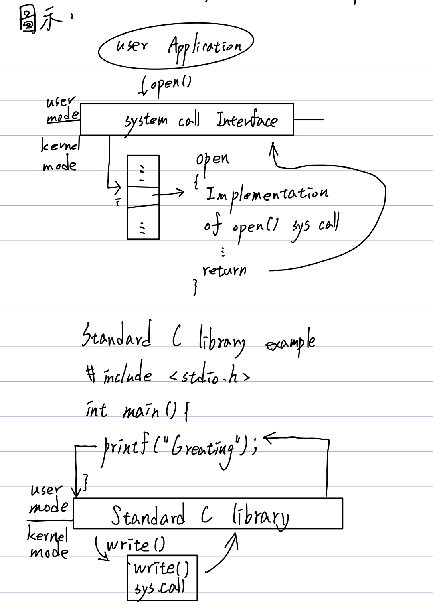
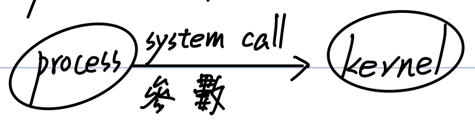

# CH3 OS Structure and Development

- OS Services provided
- OS Components概述
- System call介紹
  - Def✨
  - 種類
  - 參數傳遞方式✨✨✨
- Policy and mechanism✨✨
- OS Structures（架構）介紹
  - Simple
  - More Complex
  - Layered Approach
  - Microkernel、Monolithic✨✨✨✨
  - Modular
  - Hybrid
- Virtual machine
  - 定義
  - VMM（Hypervisor）之種類✨✨
  - Virtualization之變形✨
  - 優點（應用） -> Cloud computing✨

## System call介紹

1. 目的：作為執行中user process與kernel溝通之界面，代表OS可以提供之服務項目。當Process執行時，若需要OS提供某種服務（e.g. Disk read Text.txt的內容）時，Process會Issue Trap，代入**System call ID**（Disk read）及**相關參數**（檔名Text.txt），當OS收到此請求後，會去執行對應的System call，當完成後，再將服務結果通知回傳給Process。

   圖示：

   

2. System call種類（P30~31）

   1. Process Control（ch 4）
   
   2. File Management
   
   3. Device Management
   
   4. Information maintenance
   
   5. Communications -> 支援"Message Passing" Only
   
   6. Protection
   
      Control access to resource
   
      - Get and set permission
      - Allow and deny user Access
   
      > EX：C程式如下
      >
      > ```c
      > {
      >   int X;
      >   X = 5;
      >   int *p;
      >   //
      >   //
      >   //
      >   scanf(...); // I/O
      >   p = molloc(int); // 要求配置Memory Node space
      >   prinf(...); // I/O
      >   exit(); // Process終止
      > }
      > ```
      >
      > 上述哪些敘述會引發System Call
      >
      > 其他：fopen()、fclose()、fread()、fwrite()
   
3. System call參數傳遞方式✨

   

   - 方法一：利用Register保存參數，OS自這些Register讀取參數。

     優點：Simple、Fast access（因為Without memory access）

     缺點：不適合用在大量參數之情況（因為Register數量有限）

   - 方法二：利用Memory，以一個Block（or Table）保存這些參數，且將此Block（Table）之位址，存至一個Register中，Pass it to OS。

     優點：適用大量參數之情況。

     缺點：存取速度比較慢。

   - 方法三：準備一個Stack，參數可被Push入Stack，OS再自此Stack **pop**以取得參數。

     優點：適用於大量參數之情況，操作比較simple。

     缺點：Stack size宜過大，避免overflow［其他版本］

## Policy（政策） and Mechanism（機制）

1. Policy：決定 **What** will be done?（provided）

   特色：經常改變。

2. Mechanism：決定 **How** to do it?

   特色：underlying mechanism通常不會改變 or 改變頻率很低。

3. 例：

   用Timer作CPU protection -> Mechanism

   Max-Time-Quantum值制定 -> Policy

   用Priority作CPU sheduling -> Mechanism

   優先權大小定義 -> Policy

4. 設計原則：Policy and Mechanism應該Separate（分開；或獨立）

   => Allow high flexibility（高彈性度）
