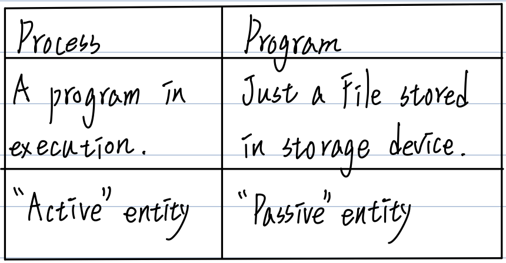

# CH4 Process Management and Thread Management

- Process定義、組成與Program之不同
- <u>PCB</u>內容
- Process <u>STD</u>:star::star::star::star::star:
- Context switching:star::star::star:
- Dispatchen、Dispatch lateacy:star:
- Schedulen種類（長短、中期）:star::star::star:
- 評估CPU scheduling效能之5個criteria:star::star::star:
- 各種CPU scheduling Algo.，計算及名詞（Preemptive、Non-Preemptive、Starvation、Aging）:star::star::star::star::star:
- Process Control Operations（UNIX system call為例、程式追蹤）:star::star::star::star::star:
- 特定System排班設計考量:star::star:
  - Multiprocessors System
  - Real-time System
- Thread Management
- CPU utilization計算:star::star::star:

## Process（其他 = Job，= task（Linux））

1. Def：A program in execution［恐］，即**執行中的程式**，當Process被建立後，Process的主要組成包含下列：

   1. **Code section（or Table section）**：即Program code
   2. **Data section**：Containg the global variables
   3. **Stack**：包含temporary data（e.g. Function Parameters、Local variables、return address）
   4. **Heap**：包含memory dynamically allocated during run time.（e.g. pointer變數之要求空間）
   5. <u>Programming Counter</u> and other registers.
      內放**下一條指令**之所在位置

   

2. Process vs. Program

   

## PCB（Process Control Block）內容

Def：當Process被建立，kernel會在kernel memory area新建一個表格（or Block），記錄該Process之所有相關資訊，稱之PCB。

- PCB之主要記錄項目資訊有：
  1. **Process No.（or ID）**：此號是uniqlo
  2. **Process state**：ready、new、running、wait state、etc.
  3. **CPU registers**：包含accumulator、Stack Top pointer、Index register、etc.
  4. **Programming Counter**：內放下一條指令位址。
  5. **CPU scheduling Info**：Process優先權值、PCB pointer、etc.
  6. **Memory Management Info**：Base / limit register值或Page Table或Segment Table。取決於OS管理Memory之方式而定。
  7. **Accounting Info**：Process使用CPU Time之最大值、目前用了多少CPU Time、多少資源、etc.
  8. **I/O-Status Info**：目前配給Process之I/O-Device為何、已發出哪些I/O-request、完成多少I/O-request、etc.

## Process之STD（State Transition Diagram）（狀態轉換圖）

- 目的：描述Process之lifecycle
- 版本：
  - ［恐］5個States
  - ［Stalling］7個States
  - ［Stalling］UNIX STD

### ［恐］5個States之STD

| State                                 | Description                                                  |
| ------------------------------------- | ------------------------------------------------------------ |
| New(created)                          | - The process is being created. - Process被建立，kernel已配置PCB space，但尚未配置Memory space。 |
| Ready                                 | The Process is waiting to be assigned to a <u>processor</u>（CPU），即Process已配置Memory space，放到Ready Queue，有資格與其他Ready processes競爭CPU。 |
| Running                               | Insturction are being executed。即Process取得CPU執行中。     |
| Waiting(Block) (sleep in memory) | - The process is waiting for some event to occur. 例：Wait for I/O-Completed. - Process puts in the wait Queue.  （不會與其他Processes爭奪CPU） |
| Terminated(Exit) (Zombie)        | The process has finished execution.                          |

| Transition                       | Description                                                  |
| -------------------------------- | ------------------------------------------------------------ |
| 1.Admitted                       | - 當Memory有足夠空間，此Process可以配置Memory space（or loadinto memory）。 - 在Batch system，可由Long-Term scheduler決定載入哪些Jobs。但Time-sharing、real-time system不用Long-Term scheduler。 |
| 2.Dispatch                       | 由Short-term scheduler（即CPU scheduler）決定哪個Process可以取得CPU，且分派CPU給它執行。 |
| 3.Exit                           | Process完成工作，釋放所有Resource。                          |
| 4.Interrupt (Time-out)      | Process執行時，因為中斷發生而被迫放掉CPU，回到"Ready" Queue。 e.g. "Time-out" interrupt. |
| 5.I/O or event wait         | Process發出請求（e.g. I/O-request、Blocking-system call、etc.），等待I/O-Completed or event occurs。 |
| 6. I/O-Completed or event occurs | I/O-Completed or event發生了，可從wait => ready state        |

### ［Stalling］7個States之STD

1. 當Memory space不夠，且又有其他Processes need more memory space，則Medium-Term scheduler可將一些Blocked processes swap out to Disk，保存其Process image，空出Memory space供其他Process使用。
2. 若Memory有足夠空間時，則Medium-term scheduler可選一些Ready / Suspen processes，Swap in them to memory，且變成Ready state再搶CPU執行。
3. 支持此Transition理由有二：
   1. 將Blocked全Swap out後仍未能獲得足夠的Memory space，所以只好將Ready processes swap out以獲取足夠Memory space。
   2. 所有正在Blocked之Processes之優先權皆高於Ready processes，所以只好Swap out ready processes。