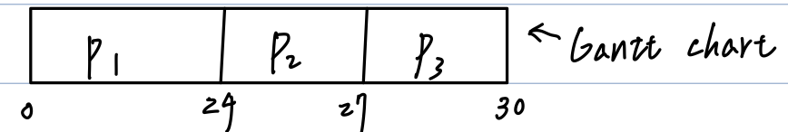

# CH4 Process Management and Thread Management

- Process定義、組成與Program之不同
- <u>PCB</u>內容
- Process <u>STD</u>:star::star::star::star::star:
- Context switching:star::star::star:
- Dispatchen、Dispatch lateacy:star:
- Schedulen種類（長短、中期）:star::star::star:
- 評估CPU scheduling效能之5個criteria:star::star::star:
- 各種CPU scheduling Algo.，計算及名詞（Preemptive、Non-Preemptive、Starvation、Aging）:star::star::star::star::star:
- Process Control Operations（UNIX system call為例、程式追蹤）:star::star::star::star::star:
- 特定System排班設計考量:star::star:
  - Multiprocessors System
  - Real-time System
- Thread Management
- CPU utilization計算:star::star::star:

## Process（其他 = Job，= task（Linux））

1. Def：A program in execution［恐］，即**執行中的程式**，當Process被建立後，Process的主要組成包含下列：

   1. **Code section（or Table section）**：即Program code
   2. **Data section**：Containg the global variables
   3. **Stack**：包含temporary data（e.g. Function Parameters、Local variables、return address）
   4. **Heap**：包含memory dynamically allocated during run time.（e.g. pointer變數之要求空間）
   5. <u>Programming Counter</u> and other registers.
      內放**下一條指令**之所在位置

   

2. Process vs. Program

   | Process                 | Program                               |
   | ----------------------- | ------------------------------------- |
   | A program in execution. | Just a file stored in storage device. |
   | "Active" entity         | "Passive" entity                      |

## PCB（Process Control Block）內容

Def：當Process被建立，kernel會在kernel memory area新建一個表格（or Block），記錄該Process之所有相關資訊，稱之PCB。

- PCB之主要記錄項目資訊有：
  1. **Process No.（or ID）**：此號是uniqlo
  2. **Process state**：ready、new、running、wait state、etc.
  3. **CPU registers**：包含accumulator、Stack Top pointer、Index register、etc.
  4. **Programming Counter**：內放下一條指令位址。
  5. **CPU scheduling Info**：Process優先權值、PCB pointer、etc.
  6. **Memory Management Info**：Base / limit register值或Page Table或Segment Table。取決於OS管理Memory之方式而定。
  7. **Accounting Info**：Process使用CPU Time之最大值、目前用了多少CPU Time、多少資源、etc.
  8. **I/O-Status Info**：目前配給Process之I/O-Device為何、已發出哪些I/O-request、完成多少I/O-request、etc.

## Process之STD（State Transition Diagram）（狀態轉換圖）

- 目的：描述Process之lifecycle
- 版本：
  - ［恐］5個States
  - ［Stalling］7個States
  - ［Stalling］UNIX STD

### ［恐］5個States之STD


| State                                 | Description                                                  |
| ------------------------------------- | ------------------------------------------------------------ |
| New(created)                          | - The process is being created.<br />- Process被建立，kernel已配置PCB space，但尚未配置Memory space。 |
| Ready                                 | The Process is waiting to be assigned to a <u>processor</u>（CPU），即Process已配置Memory space，放到Ready Queue，有資格與其他Ready processes競爭CPU。 |
| Running                               | Insturction are being executed。即Process取得CPU執行中。     |
| Waiting(Block)<br />(sleep in memory) | - The process is waiting for some event to occur.<br />例：Wait for I/O-Completed.<br />- Process puts in the wait Queue.<br /><br />（不會與其他Processes爭奪CPU） |
| Terminated(Exit)<br />(Zombie)        | The process has finished execution.                          |


| Transition                       | Description                                                  |
| -------------------------------- | ------------------------------------------------------------ |
| 1.Admitted                       | - 當Memory有足夠空間，此Process可以配置Memory space（or loadinto memory）。<br />- 在Batch system，可由Long-Term scheduler決定載入哪些Jobs。但Time-sharing、real-time system不用Long-Term scheduler。 |
| 2.Dispatch                       | 由Short-term scheduler（即CPU scheduler）決定哪個Process可以取得CPU，且分派CPU給它執行。 |
| 3.Exit                           | Process完成工作，釋放所有Resource。                          |
| 4.Interrupt<br />(Time-out)      | Process執行時，因為中斷發生而被迫放掉CPU，回到"Ready" Queue。<br />e.g. "Time-out" interrupt. |
| 5.I/O or<br />event wait         | Process發出請求（e.g. I/O-request、Blocking-system call、etc.），等待I/O-Completed or event occurs。 |
| 6. I/O-Completed or event occurs | I/O-Completed or event發生了，可從wait => ready state        |

### ［Stalling］7個States之STD


1. 當Memory space不夠，且又有其他Processes need more memory space，則Medium-Term scheduler可將一些Blocked processes swap out to Disk，保存其Process image，空出Memory space供其他Process使用。
2. 若Memory有足夠空間時，則Medium-term scheduler可選一些Ready / Suspen processes，Swap in them to memory，且變成Ready state再搶CPU執行。
3. 支持此Transition理由有二：
   1. 將Blocked全Swap out後仍未能獲得足夠的Memory space，所以只好將Ready processes swap out以獲取足夠Memory space。
   2. 所有正在Blocked之Processes之優先權皆高於Ready processes，所以只好Swap out ready processes。


下列這兩個Transition比較<u>沒有必要</u>（poor design）

1. 若所有Blocked/Suspend process之優先權高於Ready/Suspend process，且OS believes這些Blocked Process will become ready soon，則OS有理由將它們SWAP IN回Memory even they are Blocked.
2. 若有一個（些）高優先權之Block/Suspend process become ready/Suspend，則OS可以強迫Running process放掉CPU及放掉Memory space，讓此高優先權盡快SWAP IN回Memory且取得CPU執行。

### ［Stalling］UNIX STD


Note：Zombie state

Process（child）完成工作，但是Parent Process尚未來取得Child Process之相關資訊/成果。（或［恐］：Parent尚未執行到wait() system call時）
此時，Zombie process之CPU、Memory、I/O-Device等資源已經收回（released），但是其PCB尚未能刪除，直到Parent取回資料，kernel才會claer掉Zombie之PCB。

## Schedule種類

1. Long-Term schedule（長期）

   1. Def：又叫<u>Job schedule</u>，通常用在<u>Batch system</u>。

      目的：從Job Queue中排選一些Jobs，將它們載入Memory中以便執行。

   2. 特點：

      1. 執行頻率是三者中最低（所以叫Long-Term）。

      2. 可調控Multiprogramming Degree。

      3. 可調控<u>I/O-Bound Job</u>與<u>CPU-Bound Job</u>之混合比例。

         > :star:Note：
         >
         > 1. I/O-Bound job：此類型Job花在I/O-operation Time遠大於其CPU Computation time，即對<u>I/O-Device需求量大</u>，對<u>CPU需求時間很小</u>，其效能受I/O-Device Speed影響較深。例：資料庫管理系統、計算全校學生成績，並列出成績單、Interactive application。
         > 2. CPU-Bound job：此類型Job花在CPU Computation time遠大於其I/O-operation Time，即對<u>CPU需求量大</u>，對<u>I/O-Device需求時間很小</u>，其效能受CPU Speed影響較深。例：氣象預估、科學模擬實驗、基因序列比對、etc.。

      4. Batch system採用，但Time-sharing、Real-Time system不會採用。

2. Short-Term schedule（短期）

   1. Def：又叫CPU schedule或Process schedule。

      目的：從Ready Queue中排出一個合適的Process，然後分派CPU給它執行。

   2. 特點：

      1. 執行頻率是三者中最高。
      2. 不能（無法）調控Multiprogramming Degree。
      3. 不能調控I/O-Bound Job與CPU-Bound Job之混合比例。
      4. 所有System皆需要CPU schedule。

3. Medium-Term schedule（中期）

   1. Def：當Memory space不足，且又有其它Process（e.g. 高優先權）需要更多Memory space時，此Schedule會啟動執行。

      目的：排出一些Processes（e.g. Blocked process或Lowest-priority process）將它們SAWP OUT到Disk（i.e. 將它們的Process image暫置於Disk），以便空出Memory space供他人使用。未來，等到某些Process完工，釋放出足夠Memory space，再將它們SWAP IN回Memory，繼續執行未完之工作。

   2. 特點：

      1. 執行頻率是三者居中
      2. 可以調控Multiprogramming Degree
      3. 可以調控I/O-Bound Job與CPU-Bound Job之混合比例
      4. Time-sharing system採用（要支援Virtual memory）。Batch、Real-Time System不用。

## Context switching

1. Def：When CPU switches to another process, the system must <u>Save the state of the old process</u> and <u>Load the saved state for the new process</u> via a "Context switch".

   - Context of a process represented in the PCB

     CPU要從執行中的Processes切換給另一個Process使用時，OS必須保存目前執行中Process state（e.g. 保存P.C.、CPU registers value、etc. 到its PCB），同時也要載入另一個Process之State（即Load：P.C.、CPU registers value from PCB）。

     

     Context switch是一個負擔（overhead），在此段期間，無法執行任何Process，其時間長短大都取決於硬體因素。

     e.g. Context內容多寡、Memory Store/Load指令速度之快慢、是否有多套的Registers Sets可用，若有則快速。

2. 如何降低Context switching負擔？

   ［法一］：Multiple Registers Sets

   - 每個Process有自己的（Private）Registers set（if Registers數量夠多）。

     當要Context switching，kernel只須切換指標，指向另一套Registers set即可。

   ［法二］：使用Multithreading降低傳統Process之Context switch負擔。

## Dispatcher（分派器）、Dispatch latency（分派延遲）

Def：Dispatcher此一模組之目的是將CPU真正授予經由CPU schedule所排出之User process。

Dispatcher主要工作有三：

1. Context switching
2. Switch mode to user mode
3. Jump to the execution entry of that process

上述這三個工作之時間加總稱為：Dispatch latency。如果時間越短，Process就可以盡早開工。

## Process Control operations

1. 包含：Process之Creation、Terminate、Suspend、Resume、etc.管理（控制）運作。

2. 理論之基本觀念：

   1. Process Creation

      - 任何Process均可建立Processes。

        通常：Parent preocess creations many child processes。

      - 建立child process之目的，要child process執行工作。

      - child所作之工作，分為兩種：

        1. 與Parent相同之工作
        2. 與Parent不同之工作（execution a specific task）

   2. child process所需之resources由誰供應？

      1. 由OS供應
      2. 由child供應
         - 全部resource與child共享
         - subset of resource

   3. Parent與Child之互動關係如何？

      1. Parent waits for child until child Completed its task.
         or
      2. Parent與Child concurrent execution.（並行）

   4. Process之終止

      - Process完成工作，會發一個System call（e.g. exit()）告訴kernel，請kernel終止它，並收回其資源。
      - Process可能被kernel異常終止（e.g. Divide-by-zero）。
      - Parent基於下列理由，可能終止Child process
        - Child已完成交辦工作。
        - Child使用過多之資源。
        - Parent被終止（by kernel），其下所有Child一併終止。
          => 稱為Cascading termination
      - 有時，parent終止後，有些OS允許其Child續存，此時Child資源：
        - 由OS供應
        - 由Grandparent級以上祖先供應

## 以UNIX sytem call為例，介紹相關System call及程式追蹤:star:

1. fork()

   Def：此System call用以建立Child process，Child process會被配置與Parent不同的Memory space（by kernel），且Child之Code section、Data section等內容，均來自Parent內容之Copy initially。

   :star:fork()的回傳值有下列：

   - 失效（無法建立Child）：傳負值（-1）給kernel，kernel通知Parent。（<u>因為資源不足</u>）
   - 成功：回傳0值給Child process；並回傳>0的值給Parent，且此值為Child之PID（process ID）。

   

   **因此，如果child要做跟parent相同之工作，則fork()完即可達成目的。**

2. exit()

   Def：此system call用以終止process，當process完成工作，要發exit() system call通知kernel，請kernel終止process，且release its resources。通常，**exit(0)為正常結束**，**exit(-1)為異常結束**。

   > OS收到此system call，若是child process發出，kernel也會通知parent說此child已經終止。

3. wait()

   Def：此system call用以暫停process執行直到某事件發生，才可往下繼續執行。
   **e.g. parent等待child直到child完成工作並終止**

   > 補充：
   >
   > 若child已終止，而parent尚未執行wait()，這段期間child已停止活動，但kernel還不能清除child PCB，直到parent來collect child's info，此段期間child is a Zombie。

4. execlp() or exec()

   Def：此system call用以<u>載入</u>特定的binary code（or machine code）file到memory中執行。
   格式：**execlp("目錄", "檔名", 參數)**

   > 例：
   >
   > 生出child後，要child執行specific task（不同於parent），則child可以用execlp() system call載入特定工作來執行，that is child process之memory context就不再是parent之copy。

5. getpid()

   Def：此system call用以取得<u>當前process ID</u>。

## 程式追蹤

例1：
建立child process執行ls命令檔，且process system call必須等待child完成後，再印出"child completed"
Ans：

```c
void main(int argc, char *argv[]){
	int pid;
	pid = fork();
	if(pid < 0){
		fprintf(stderr, "fork Failed");
		exit(-1);
	}
	else if(pid == 0)
		execlp("/bin/ls", "ls", NULL);
	else{
		wait(NULL);
		printf("Child Complete");
		exit(0);
	}
}
```

例2：P.94（程式3）
Ans：0、2603、2603、2600

例3：P.95（程式4）
Ans：5

例4：求執行結果
程式碼：

```c
void main(){
	int pid;
	pid = fork();
	if(pid == 0){
		printf("A\n");
		exit(0);
	}
	else if(pid > 0){
		wait();
		printf("B\n");
	}
	printf("C\n");
}
```

1. 結果為何？
   Ans：<u>A</u>（child）<u>BC</u>（parent）
2. 刪去child中的exit()呢？
   Ans：<u>AC</u>（child）<u>BC</u>（parent）
3. 承2，再將parent中wait()與printf("B\n")對調？
   Ans：<u>ACBC</u> or <u>ABCC</u> or <u>BACC</u>
4. 承3，再刪child中的wait()呢？
   Ans：<u>ACBC</u> or <u>BCAC</u> or <u>ABCC</u> or <u>BACC</u>

例5：How many process are created？（include main()）

1. 第一題

   ```c
   void main(){
       fork();
       fork();
       fork();
   }
   ```

   

2. 第二題

   ```c
   void main(){
     if(fork() == 0){
       fork();
       fork();
     }
   }
   ```

   
   
3. 第三題

   
   
4. 第四題

   ```c
   void main(){
     for(i = 0; i < 3; i++)
       if(fork() == 0){
         fork();
         fork();
         fork();
       }
   }
   ```

   

例6：P.104 例16

例7：假設c是一共享變數（parent與child皆可Access），初值 = 5，求以下執行結果
程式碼：

```c
int c = 5;
void main(){
  int pid();
  pid = fork();
  if(pid == 0)
    c = c + 1;
  else // pid > 0
    c = c - 1;
  printf("%d\n", c);
}
```


## 評估CPU Scheduling效能之5個criteria

1. CPU utilization（CPU利用率）

   Def：CPU花在<u>Process Execution Time</u> 除以 <u>CPU Total Time</u>（Exec. Time + C.S Time + idle Time）。

   > 例：
   >
   > process平均花10ms執行
   >
   > Context switching負擔 = 2ms
   >
   > 所以CPU utilization = 10 / (10 + 2) = 10 / 12

2. Throughput（產能）

   Def：單位時間內完成的Job（process）數目。

3. Waiting Time（等待時間）

   Def：process待在ready Queue中，等待取得CPU之所有等待時間加總。

   > 例：
   >
   > 
   >
   > its waiting time = (10 - 2) + (23 - 15) + (32 - 27) = 8 + 8 + 5 = 21

4. Turnaround Time（完成時間）

   Def：自process到達（進入系統）至其完成工作之此段時間差值。

   > 例：
   >
   > 承上，its turnaround time = 40 - 2 = 38

5. Respone Time（回應時間）

   Def：自User輸入Data / Command後，至<u>系統產生第一個回應</u>的時間。
   Time-sharing system（or Interactive Application）特別重視。

## 各式CPU Scheduling Algorithm

- FIFO
- SJF
- SRTF(SRIN)(SRJF)
- priority
- RR(Round-Robin)
- Multilevel Queues
- Multilevel Feedback Queue(MFQs)

### FIFO法則

1. Def：Arrival Time最小（即最早到達）之process，優先取得CPU。

   > 例：
   >
   > | Process | Burst Time |
   > | ------- | ---------- |
   > | P1      | 24         |
   > | P2      | 3          |
   > | P3      | 3          |
   >
   > - 到達時間皆為0
   > - 到達順序：P1、P2、P3
   >
   > 
   >
   > 1. 求平均Waiting Time
   >
   >    P1：0 - 0 = 0
   >
   >    P2：24 - 0 = 24
   >
   >    P3：27 - 0 = 27
   >
   >    Avg. = (0 + 24 + 27) / 3 = 17
   >
   > 2. 求平均Turnaround Time
   >
   >    P1：24 - 0 = 24
   >
   >    P2：27 - 0 = 27
   >
   >    P3：30 - 0 = 30
   >
   >    Avg. = (24 + 27 + 30) / 3 = 27

2. 特性：

   1. 簡單、易實施

   2. 排班效能最差（即Avg. Waiting Time and Avg. Turnaround Time最長）

   3. 可能會遭遇"Conroy Effect"（護衛效應）
      Def：許多process均在等待一個需要很長CPU time之process完成工作後，才能取得CPU，造成平均等待時間大幅增加之不良效應。

   4. 公平（總有一天輪到你）

   5. No starvation（不會餓死）:star:

      > 名詞Starvation（飢餓現象）
      >
      > 1. Def：若process因為長期無法取得完成工作需之各式資源，導致它遲遲無法完工，形成"Indefinite Blocking"。
      >
      >    - 容易發生在不公平對待（e.g. 高、低優先權差別）的環境，若再加上"Preemptive"（可搶奪）機制，更是容易發生。
      >
      >    Note：<u>有機會完工，但是機會渺茫。</u>
      >
      > 2. 解法：可採取"Aging"技術。
      >    Def：隨著process待在系統的時間增加，也逐步調高它的優先權，經過有限的時間後，其數值會最高，故可取得資源完工，所以不會Starvation。
      >    Note：Soft real-Time system不准使用Aging。

   6. 屬於"Non-preemptive"法則:star:

      > Non-preemptive and preemptive法則
      >
      > ［白話文版本一］：
      >
      > 1. Non-preemptive法則（=Cooperative）
      >
      >    1. Def：除非執行中的process自願釋放CPU，其他processes才有機會取得CPU執行，即其他人只能等待。（e.g. 完成工作（exit）、發I/O-reguest後，wait for I/O-Completed）
      >
      >    2. 優點：
      >
      >       1. Process一旦取得CPU，其完工時間點較可預期。
      >       2. Context switch次數相對較少。
      >       3. 較不會發生race condition problem，尤其是kernel，當kernel正在執行相關system call或ISRs時，<u>不希望</u>被User process preempts，是想要Kernel Data Structures不會race condition。（**ch6**）
      >
      >       缺點：
      >
      >       1. 排班效能通常較差。（因為會有Conroy effect，所以平均等待時間長）
      >       2. 對Real-Time system、Time-sharing system不適合。